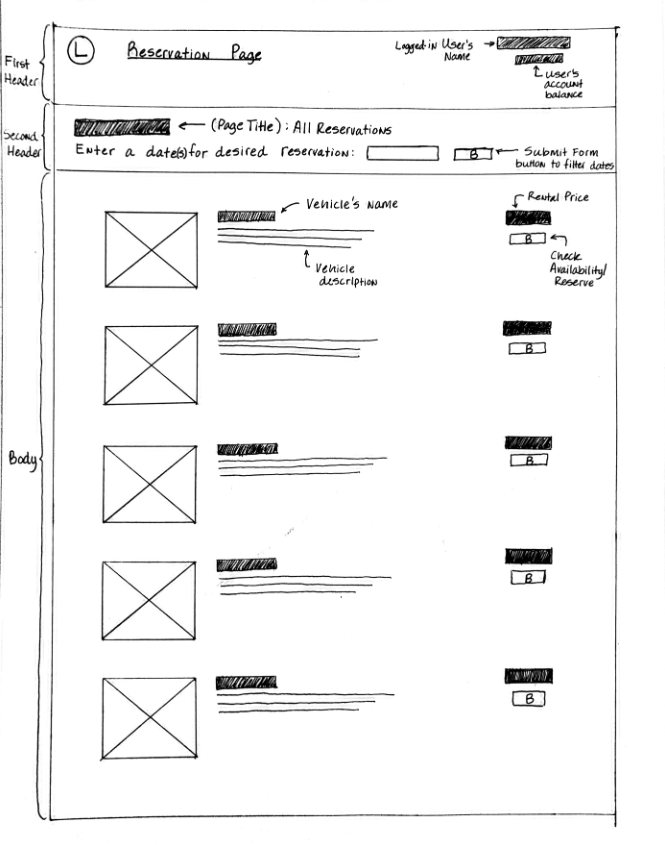
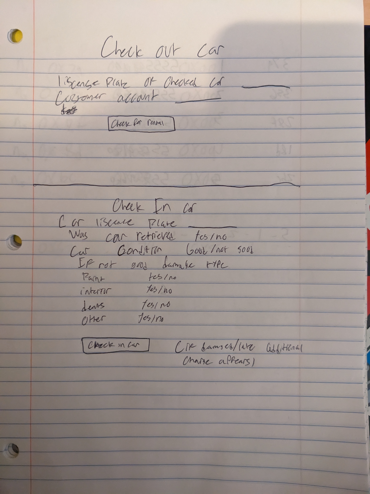
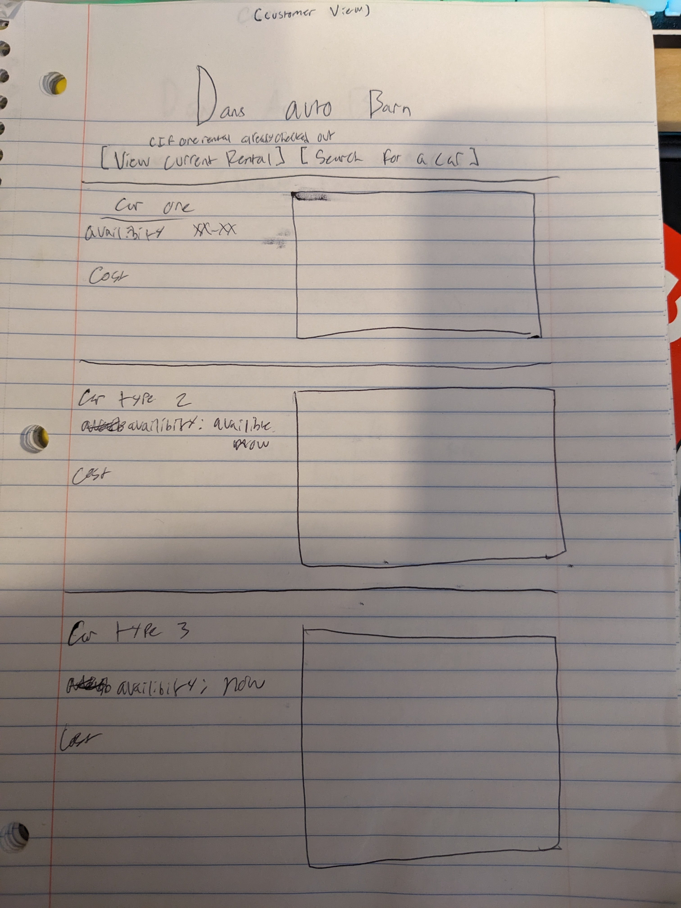
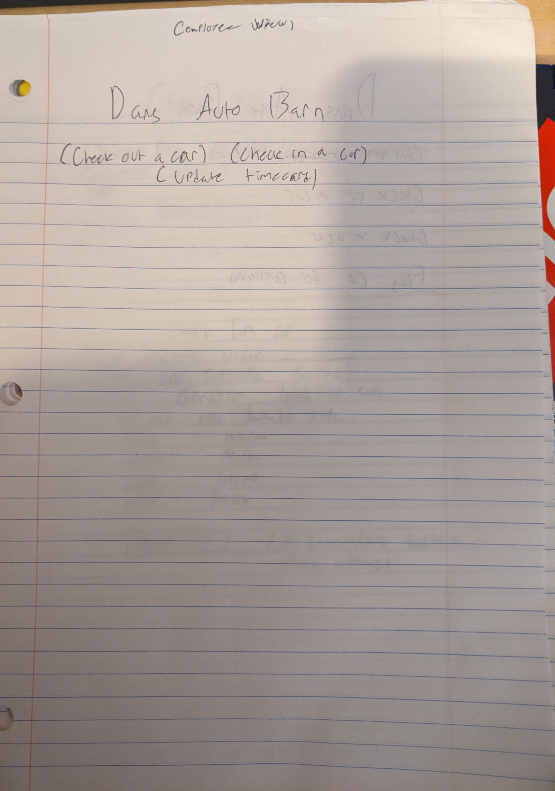
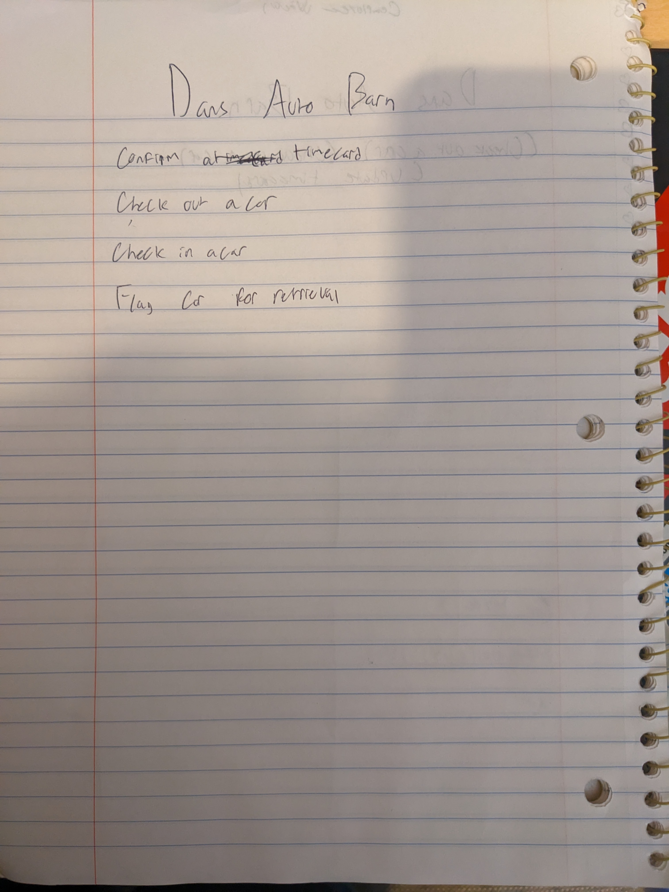

# Low-Fidelity Prototypes
## Table of Contents
1. [Search for Reservation](#search-for-reservation)
1. [Customer Checks in/out Car](#customer-checks-inout-car)
1. [Customer Dashboard](#customer-dashboard)
1. [Employee Dashboard](#employee-dashboard)
1. [Manager Dashboard](#manager-dashboard)

**Symbol key**
1. Rectangle enclosing a "B" - represents a button
2. Circle enclosing a "L" - represents company logo
3. Horizontal lines - represent text
4. Rectangle with diaganol lines - represents images
5. Filled/Shaded rectangle - represents dynamic page elements that correspond with the decription in the figure
6. Empty rectangle - represents user-input form elements

# Search for Reservation
> Logged-in/Authenticated user searches for a car. The view is not filtered for reservation availability.

## Notes
- The first header indicates the title of the view along with the authenticated user's name and balance.
- The second header indicates whether the view is filtered/not-filtered. If not-filtered, the user is presented with an input-form to enter dates to filter reservations.
- The body shows images of each car in the reservation inventory, with a corresponding name of the car, description, and price for the rental. In this figure, no filter has been applied and therefore each car in the inventory is displayed regardless of availabilty. Each car has a button to reserve, if available.

# Customer checks in/out car
> A user who has already made a reservation is presented with the plate information in order to pick up their car
> A user returns a reservation

# Customer Dashboard
> Main page of customer

# Employee Dashboard
> Main page of employee

# Manager Dashboard
> Main page of manager

