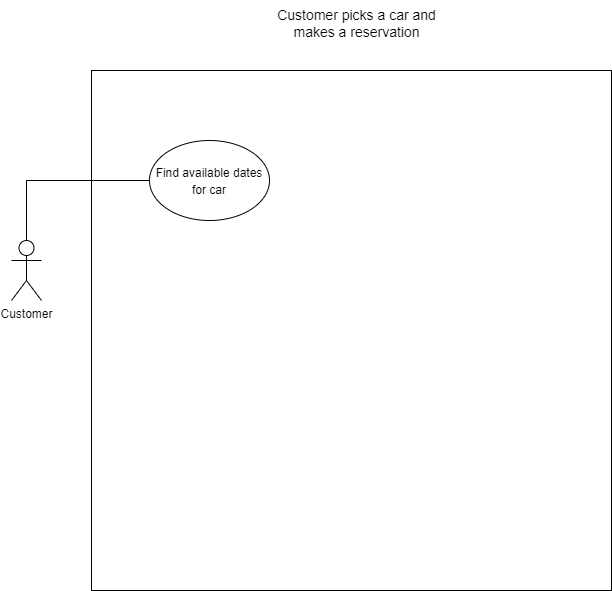

# Use-Case Diagrams

1. [Customer makes reservation on a car](#use-case-1)
2. [Customer picks up car](#use-case-2)
3. [Manager goes to pay employees](#use-case-3)
4. [Login authentication for customers/employees](#use-case-4)
5. [Customer adds money to balance](#use-case-5)
6. [Customer cancels order](#use-case-6)
7. [Account creation/modification/deletion](#use-case-7)

**If one of the diagrams needs to be changed:**
1. Open the corresponding `.drawio` file online using [draw.io](https://draw.io)
2. Update the file as needed
3. Save a copy of the file as a `.png` and place it in `figs/`
4. Update this `README.md` if necessary

## Use Case 1

> Customer makes a reservation on a car

Participating Actor: Customer

Entry conditions:
- Customer wants to make a car reservation

Exit conditions (mutually exclusive):
- Customer is able to make the reservation
    - Dates are available **and** the customer has sufficient funds
- Customer is unmable to make the reservation
    - Dates are unavailable **or** the customer has insufficient funds

Event flow:
1. Customer logs into the webpage
2. Customer searches for the car they want
3. System displays available cars
4. Customer selects a car
5. System displays available dates for the car
6. Customer selects from available dates
7. System validates that customter has sufficient funds
8. System displays purchase confirmation and pick-up validation code

## Use Case 2

> Customer picks up car

Participating Actor: Actor

Entry conditions:
- Condition

Exit conditions (mutually exclusive):
- Condition

Event flow:
- Flow items

## Use Case 3

> Manager goes to pay employees

Participating Actor: Actor

Entry conditions:
- Condition

Exit conditions (mutually exclusive):
- Condition

Event flow:
- Flow items

## Use Case 4

> Login authentication for customers/employees

Participating Actor: Actor

Entry conditions:
- Condition

Exit conditions (mutually exclusive):
- Condition

Event flow:
- Flow items

## Use Case 5

> Customer adds money to balance

Participating Actor: Actor

Entry conditions:
- Condition

Exit conditions (mutually exclusive):
- Condition

Event flow:
- Flow items

## Use Case 6

> Customer cancels order

Participating Actor: Actor

Entry conditions:
- Condition

Exit conditions (mutually exclusive):
- Condition

Event flow:
- Flow items

## Use Case 7

> Account creation/modification/deletion

Participating Actor: Actor

Entry conditions:
- Condition

Exit conditions (mutually exclusive):
- Condition

Event flow:
- Flow items

