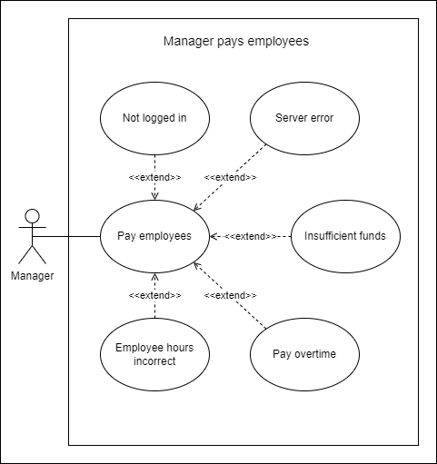
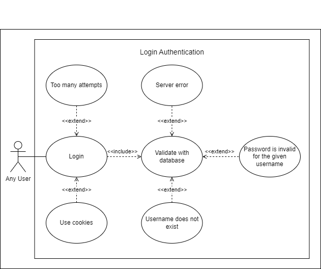
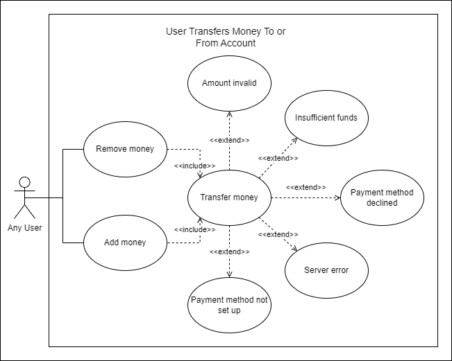
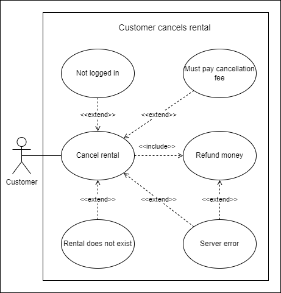
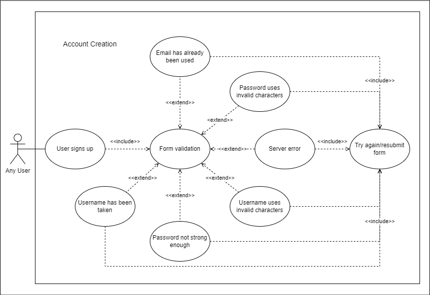

# Use Case Diagrams

1. [Customer makes reservation on a car](#use-case-1)
2. [Customer picks up car](#use-case-2)
3. [Manager goes to pay employees](#use-case-3)
4. [Login authentication for customers/employees](#use-case-4)
5. [Customer adds money to balance](#use-case-5)
6. [Customer cancels order](#use-case-6)
7. [Account creation/modification/deletion](#use-case-7)
8. [Another one here](#use-case-8)

**If one of the diagrams needs to be changed:**
1. Open the corresponding `figs/UseCaseX.png` file online using [draw.io](https://draw.io)
2. Update the file as needed
3. Update this `README.md` if necessary

## Use Case 1

> Customer makes a reservation on a car

### Participating Actor
- Customer

### Entry conditions:
- Customer wants to make a car reservation

### Exit conditions:
- Customer is able to make the reservation

-OR-
- Customer is unable to make the reservation

### Event flow:
1. Customer logs into the webpage
2. Customer searches for the car they want
3. System queries database for available cars matching search parameters
4. System displays available cars
5. Customer selects a car
6. System displays available dates for the car
7. Customer selects from available dates
8. System validates that customer has sufficient funds
9. System displays purchase confirmation and pick-up validation code

## Use Case 2

> Customer picks up car

### Participating Actors
- Customer
- Till Operator

### Entry conditions:
- Customer needs to pick up the car that they rented on the website

### Exit conditions:
- Customer drives away in car
- Till person verifies that the car has been taken out

**OR**
- Customer is turned away

### Event flow:
1. Customer goes to rental place
1. Customer shows till operator the PIN/QR code/etc that was generated with online rental
	- If customer does not have a code, they cannot rent the car
2. Till operator enters code into system and validates rental
	- If the code is invalid, the till operator asks for a different code or turns the customer away
3. Till operator asks customer if they want insurance
	- If they do not buy insurance, enable the system to make the car break down after at a random time sometime during their rental
4. Till operator (or someone else) gets car for customer
5. Till operator verifies that the car has been given out to the customer

## Use Case 3

> Manager pays employees

### Participating Actor
- Manager

### Entry conditions:
- Manager goes to pay employees

### Exit conditions:
- Employees are paid
- Manager no longer needs to pay employees

### Event flow:
1. Manager logs in to website
2. Manager views/verifies employees' worked hours
3. Manager pays employees

## Use Case 4

> Login authentication for customers/employees

### Participating Actor
- Actor

### Entry conditions:
- Condition

### Exit conditions:
- Condition

### Event flow:
- Flow items

## Use Case 5

> Customer adds money to balance

### Participating Actor
- Actor

### Entry conditions:
- Condition

### Exit conditions:
- Condition

### Event flow:
- Flow items

## Use Case 6

> Customer cancels order

### Participating Actor
- Actor

### Entry conditions:
- Condition

### Exit conditions:
- Condition

### Event flow:
- Flow items

## Use Case 7

> Account creation/modification/deletion

### Participating Actor
- Actor

### Entry conditions:
- Condition

### Exit conditions:
- Condition

### Event flow:
- Flow items

## Use Case 8

> Some other use case here

### Participating Actor
- Actor

### Entry conditions:
- Condition

### Exit conditions:
- Condition

### Event flow:
- Flow items
